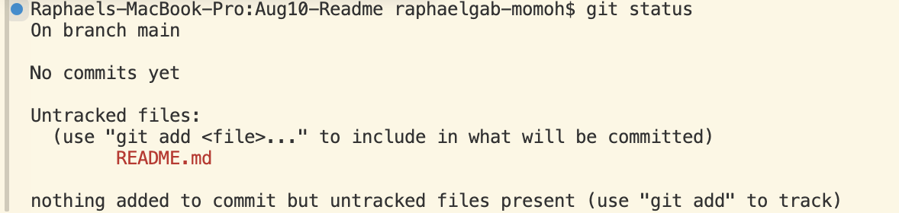
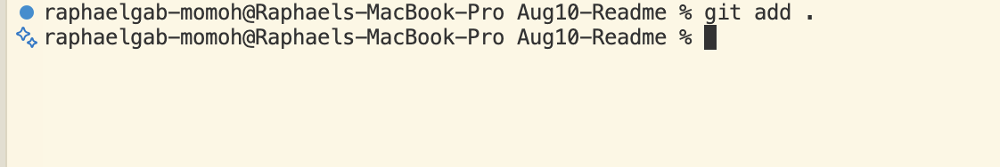
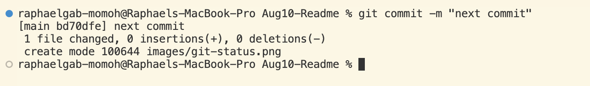

# This Lesson is About How To Write a README.md file  
---
## Overview  
- Create a Directory/Folder  
```bash
mkdir practice
```  
---  
- Initialise the Directory  
```bash
git init
```  
---
- Create a file  
```bash
touch README.md
```  
---
## Add content to file  
---
## Check the if the files are tracked or untracked,add to staging & commit  
---  
- Check the status 
```bash
git status 
```

---
- Add file to the staging Area  
```bash
git add .  
``` 
 
---
- Commit the files  
```bash
git commit -m "initial commit"
```  


## Create a new repo on GitHub to receive your work and add the remote URL.

```bash
git remote add origin https://github.com/raphgm/readmelesson2.git 
```  
---
```bash
git remote -v
```  
---
```bash
git branch -M main
```  
---
```bash
git push -u origin main
```  
---